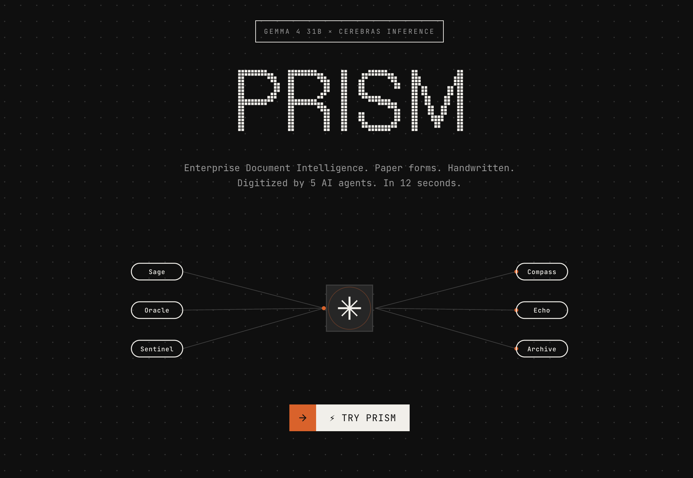
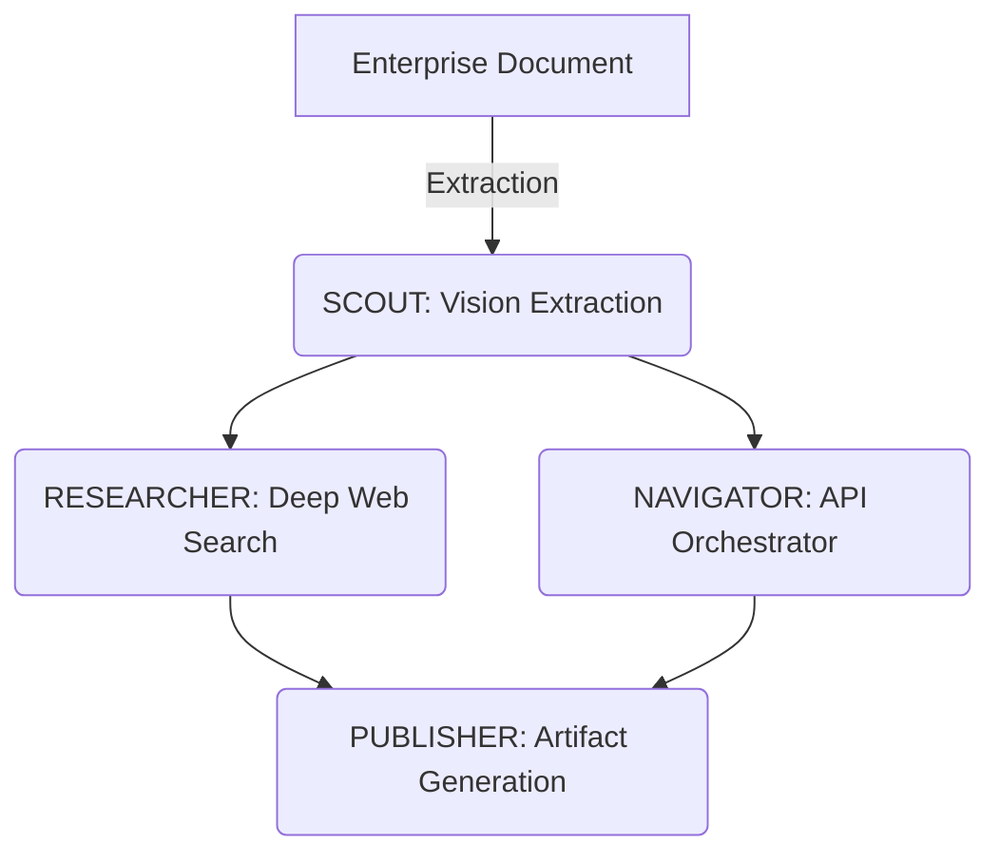
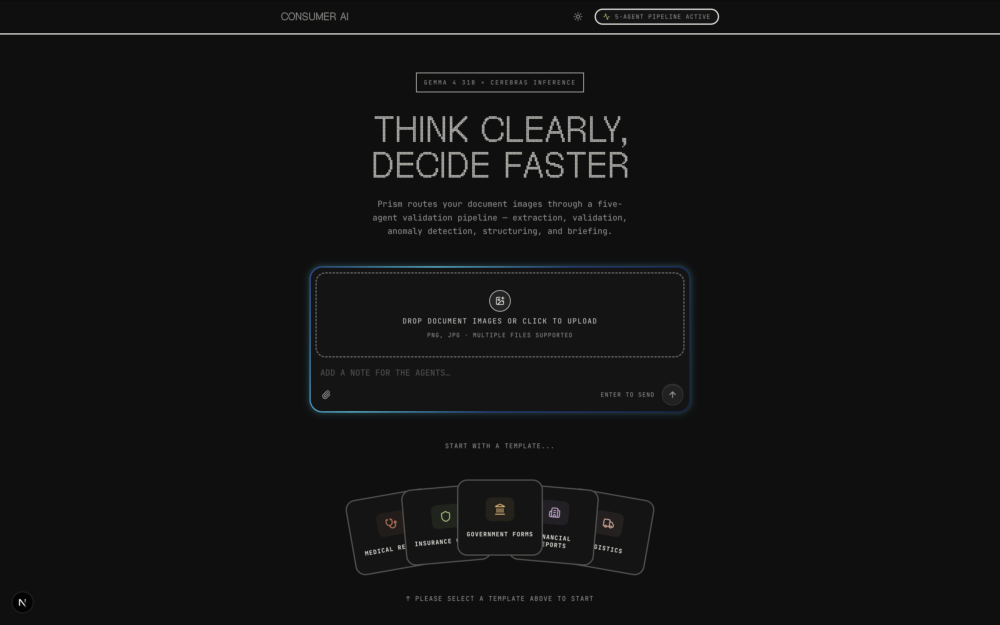
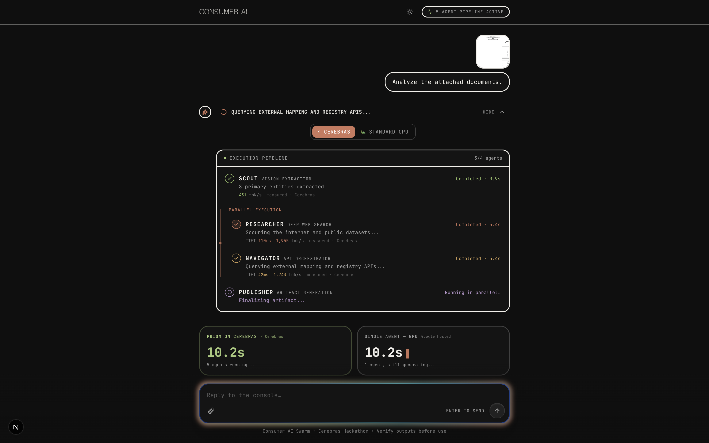
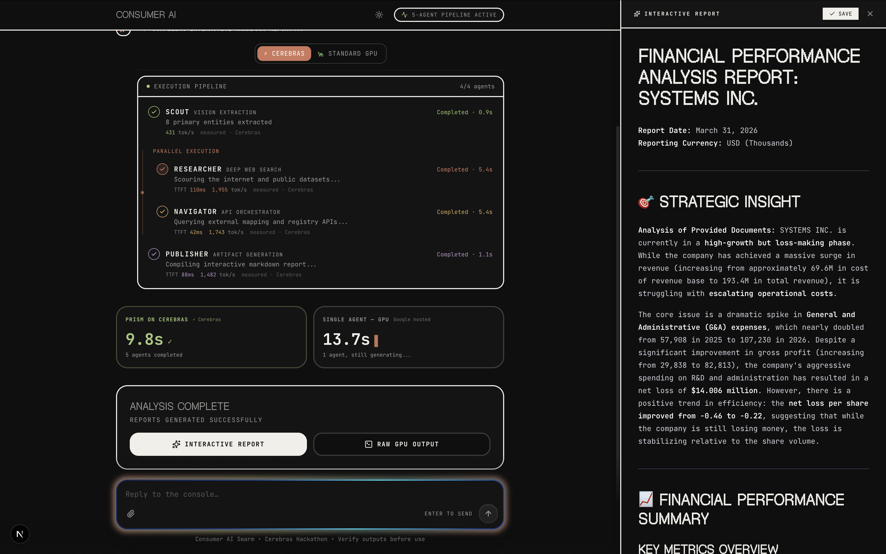

<div align="center">
  

  <h1>PRISM</h1>
  <p>
    <b>Paper forms. Handwritten. Digitized by 5 AI agents. In 12 seconds.</b>
  </p>
  <p>
    Powered by <b>Cerebras</b> & <b>Gemma 4 31B</b>
  </p>
  <p>
    <a href="#demo">View Demo</a> ·
    <a href="#how-it-works">How it Works</a> ·
    <a href="#architecture">Architecture</a>
  </p>
</div>

---

## Cerebras × Google DeepMind Gemma 4 Hackathon

Prism is a multi-agent AI platform built for the **Enterprise Impact**, **Multiverse Agents**, and **People's Choice** tracks of the Cerebras Hackathon.

We set out to solve a massive real-world physical problem: **Enterprise Document Digitization.** 
Across industries, thousands of hours are lost daily manually transcribing handwritten forms into digital systems. Prism routes document images through a dynamic five-agent validation pipeline capable of handling multiple complex verticals, including:
- **Medical Records** (e.g., Dialysis monitoring forms)
- **Insurance Claims**
- **Government Forms**
- **Financial Records**
- **Logistics & Shipping**

**Prism** leverages the speed of Cerebras and the multimodal intelligence of Gemma 4 31B to completely automate this pipeline for any industry. 

### Why Cerebras? The Speed Differentiation
At standard GPU speeds (e.g., 47+ seconds), running a 5-agent pipeline on a document is a background batch job. 
At **Cerebras speeds (12 seconds at 1,500 TPS)**, it becomes a **real-time interactive UX**. Enterprise teams can take a photo of a form and instantly get structured, validated records before the client or patient even leaves the room.

---

## Dynamic Agent Swarm

Prism uses a highly orchestrated pipeline of specialized agents. Each agent relies on the output of the previous ones, making it a true **Multiverse Agent** swarm that dynamically adapts to the selected template.

### The Enterprise Swarm (Financial, Govt, Logistics, Insurance)
For complex enterprise datasets, Prism routes to a rapid 4-agent pipeline:



1. **SCOUT (Vision Extraction)**: Extracts primary entities and raw structured data from the document.
2. **RESEARCHER (Deep Web Search)**: Scours public datasets and the web for entity verification. *(Runs in parallel with Navigator)*
3. **NAVIGATOR (API Orchestrator)**: Queries external mapping and registry APIs for data enrichment. *(Runs in parallel with Researcher)*
4. **PUBLISHER (Artifact Generation)**: Compiles the extracted and enriched data into a comprehensive interactive markdown report.

---

## See It In Action

*Hackathon Judges: Watch our [60-Second Demo Video](#) to see the live dual-timer comparing Cerebras against a GPU baseline.*

### 1. The Upload

*Select your template (Medical, Insurance, Government, Financial, or Logistics) and drag-and-drop the handwritten form to begin the process.*

### 2. The Live Pipeline

*Watch the 5 agents collaborate in real-time. Execution is streamed directly to the UI via Server-Sent Events.*

### 3. The Final Record

*The messy handwriting is converted into clean, validated JSON and actionable insights, ready for enterprise database ingestion.*

---

## Tech Stack & Architecture

Prism is built to be production-ready and scalable for enterprise systems.

- **AI Inference**: [Cerebras Inference API](https://cerebras.ai/) running `gemma-4-31b`
- **Backend**: Python, FastAPI, Asyncio (for parallel agent execution), SSE (Server-Sent Events) for real-time UI updates
- **Frontend**: Next.js 14, React, TailwindCSS, Shadcn UI, Framer Motion
- **Database**: Supabase (PostgreSQL) for persistent record storage


---

## Running Prism Locally

### Prerequisites
- Node.js (v18+)
- Python 3.10+
- A Cerebras API Key
- A Supabase Project

### 1. Start the Backend (FastAPI)
```bash
cd prism-api
python3 -m venv venv
source venv/bin/activate
pip install -r requirements.txt

# Copy .env.example to .env and add your CEREBRAS_API_KEY
cp .env.example .env

# Run the server
uvicorn main:app --reload --port 8000
```

### 2. Start the Frontend (Next.js)
```bash
cd prism-app
npm install

# Add NEXT_PUBLIC_API_URL=http://localhost:8000 to your .env.local
cp .env.example .env.local

# Run the frontend
npm run dev
```

Visit `http://localhost:3000` to run the application locally.

---
<div align="center">
  <p>Built for the Cerebras × Google DeepMind Hackathon.</p>
</div>
